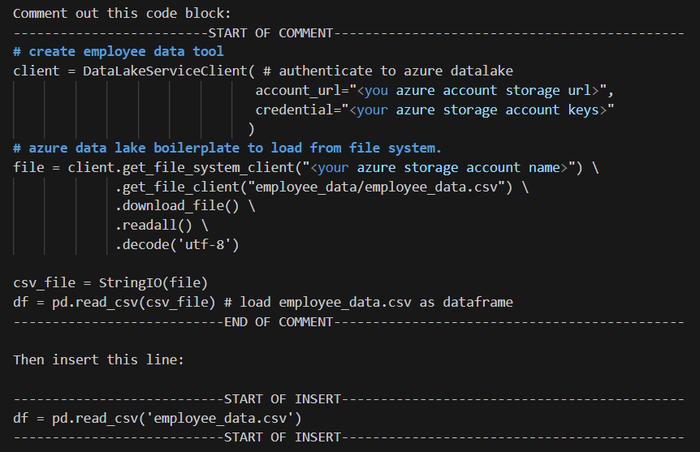
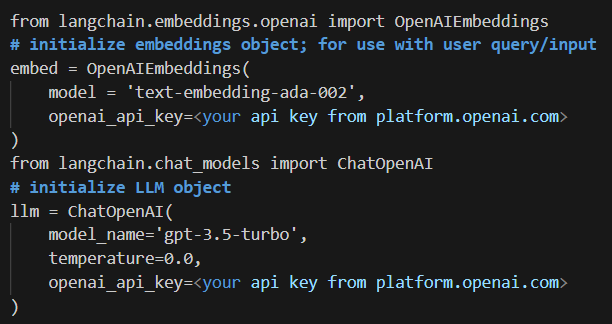

# Autonomous HR Chatbot built using ChatGPT, LangChain, Pinecone and Streamlit

Companion Reading: [Creating a (mostly) Autonomous HR Assistant with ChatGPT and LangChain’s Agents and Tools](https://medium.com/@stephen.bonifacio/creating-a-mostly-autonomous-hr-assistant-with-chatgpt-and-langchains-agents-and-tools-1cdda0aa70ef)

 
 

### Instructions:

1. Clone the Github repo to a local directory  
2. Input your own API keys in the hr_agent_backend.py file  
3. Navigate to the local directory via terminal  
4. Run 'streamlit run hr_agent_frontent.py' in your terminal

#### Running with a csv file saved locally (does not require Azure Data Lake)

#### Running with API keys from from platform.openai.com (and not Azure)
Replace the code blocks below in hr_agent_backend.py with the following openai counterparts.

### Author:

#### Stephen Bonifacio

Feel free to connect with me on:

Linkedin: https://www.linkedin.com/in/stephenbonifacio/  
Twitter: https://twitter.com/Stepanogil  
Or drop me an email at: stephen.bonifacio@jgsummit.ph
