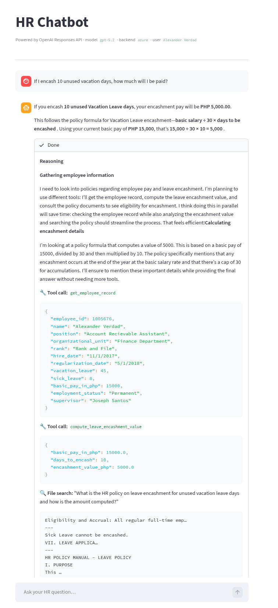

# HR Chatbot — v2 (OpenAI Responses API)

A modernized rewrite of the [original HR chatbot](../README.md) using the **OpenAI Responses API** directly — no LangChain, no Pinecone. Surfaces real model reasoning via `gpt-5.2`'s reasoning summaries and demonstrates the Responses API's native function calling and `file_search` built-in tool.

#### Sample Chat



## What changed vs. the 2023 version

| | Original (2023) | v2 (2026) |
|---|---|---|
| **Framework** | LangChain `0.0.220` | None — pure OpenAI SDK |
| **Model** | `gpt-3.5-turbo` | `gpt-5.2` |
| **"Thought" panel** | LangChain `verbose=True` scratchpad text | Real reasoning summaries from the model |
| **RAG** | Pinecone vector DB + manual embeddings | OpenAI `file_search` built-in tool |
| **Employee data tool** | `PythonAstREPLTool` (arbitrary code exec) | Typed function tools |
| **Frontend** | `streamlit-chat` (deprecated) | Native `st.chat_message` / `st.status` |
| **State** | Full message replay each turn | `previous_response_id` (server-side) |

## Tech stack

- [OpenAI Python SDK](https://github.com/openai/openai-python) `>=1.55`
- [Streamlit](https://streamlit.io/) `>=1.40`
- [pandas](https://pandas.pydata.org/) — employee data
- [python-dotenv](https://github.com/theskumar/python-dotenv)

## Setup

### 1. Install dependencies

```bash
cd v2
pip install -r requirements.txt
```

### 2. Configure environment

```bash
cp .env.example .env
```

Fill in `OPENAI_API_KEY` (or Azure vars if using the Azure backend). Leave `OPENAI_VECTOR_STORE_ID` blank for now.

### 3. Ingest the HR policy (one-time)

This uploads `hr_policy.txt` into an OpenAI vector store used by the `file_search` tool:

```bash
python ingest_policy.py
```

Copy the printed `vs_…` ID into your `.env` as `OPENAI_VECTOR_STORE_ID`.

### 4. Run

```bash
streamlit run app.py
```

## Azure OpenAI

Set `BACKEND=azure` in `.env` and fill in the `AZURE_OPENAI_*` variables.

Requirements for the Azure deployment:
- A `gpt-5.n` deployment (or any reasoning model that supports the Responses API)
- A vector store created via your Azure OpenAI resource (run `python ingest_policy.py` with `BACKEND=azure` set)

> **Note:** Azure Data Lake CSV loading (from the original `hr_agent_backend_azure.py`) is not included here. Place `employee_data.csv` locally and point `EMPLOYEE_CSV_PATH` to it, or extend `tools.py` to load from Azure Data Lake using `azure-storage-file-datalake`.

## Files

| File | Purpose |
|---|---|
| `app.py` | Streamlit UI — renders reasoning panel, tool traces, final answer |
| `agent.py` | Responses API streaming loop — dispatches tool calls, yields events |
| `tools.py` | Typed function tools + JSON schemas + dispatch table |
| `backend_local.py` | OpenAI client + config |
| `backend_azure.py` | AzureOpenAI client + config |
| `ingest_policy.py` | One-time script to create vector store and upload `hr_policy.txt` |

---

## Sample questions to try

- "How many vacation leaves do I have left?"
- "What's the policy on unused vacation leave?"
- "If I encash 10 unused vacation days, how much will I be paid?"
- "Who are the direct reports of Joseph Santos?"
- "Can I apply for sick leave while on probation?"
